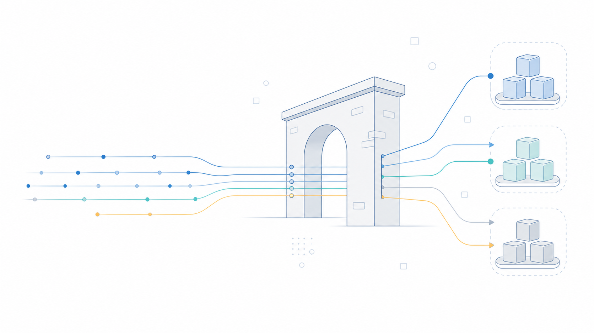

# AegisGate

> **面向可预测运行的事件驱动 HTTP 网关。**

[English](README.md) | [简体中文](README.zh-CN.md)



AegisGate 是面向 Linux 服务的 HTTP/1.1 反向代理。它将请求路由到上游服务，并将对象所有权、过载保护、故障处理和配置变更设计为明确且可观测的行为。

项目提供可运行演示和可复现验证；它**不会**在缺乏部署证据时宣称“生产就绪”，也不会给出可泛化的吞吐量承诺。

## 核心能力

- 基于 `epoll`、`eventfd`、`timerfd` 和非阻塞 socket 的 Linux 事件驱动 I/O。
- Host/path 路由、加权与 least-active 选择、worker 本地连接池。
- 全局准入、超时、受限重试、健康检查和熔断。
- 多 worker I/O、响应背压、原子配置重载、Prometheus 指标和 JSON Lines 日志。

## 快速开始

```bash
docker compose -f deploy/docker-compose.yml up --build
curl -i -H 'Host: normal.demo.local' http://127.0.0.1:8080/
curl -s http://127.0.0.1:8080/metrics
docker compose -f deploy/docker-compose.yml down -v --remove-orphans
```

验证转发、日志输出和 SIGHUP 重载：

```bash
./scripts/verify-compose-demo.sh
```

本地构建：

```bash
cmake -S . -B build/release -G Ninja -DCMAKE_BUILD_TYPE=Release -DBUILD_TESTING=OFF
cmake --build build/release
./build/release/aegisgate_server configs/demo.yaml 8080 --log-path ./aegisgate.jsonl
```

## 文档

| 主题 | English | 简体中文 |
|---|---|---|
| 架构与对象所有权 | [Read](docs/en/architecture.md) | [阅读](docs/zh-CN/architecture.md) |
| 运维与重载 | [Read](docs/en/operations.md) | [阅读](docs/zh-CN/operations.md) |
| 指标与日志 | [Read](docs/en/observability.md) | [阅读](docs/zh-CN/observability.md) |
| 协议边界 | [Read](docs/en/limitations.md) | [阅读](docs/zh-CN/limitations.md) |
| 基准证据 | [Read](docs/en/benchmark-report.md) | [阅读](docs/zh-CN/benchmark-report.md) |
| 发布验证 | [Read](docs/en/release-validation.md) | [阅读](docs/zh-CN/release-validation.md) |

## 架构

```text
客户端 → Acceptor → I/O workers → 上游服务
                    │
                    ├─ ClientConnection / ProxyTransaction
                    ├─ worker 本地选择态、计时器、连接池
                    └─ 流式响应背压

控制面：不可变配置 generation、全局准入、健康/熔断协调、
重载、指标和结构化日志。
```

任何归属 event loop 的对象只能由该 loop 的 owner thread 访问。跨线程工作通过有界队列和 wake fd 传递；socket 描述符只通过 `FdOwner` 转移。

## 验证

仓库维护 Debug ASan/UBSan、plain 和 ThreadSanitizer 门禁。基准脚本覆盖正常转发、准入限流、熔断恢复、512 KiB 慢读客户端背压，以及有在飞流量时的原子重载。

```bash
./benchmark/run.sh normal 1 5 10 3
```

解释测试结果前，请先阅读 [benchmark 指南](benchmark/README.md)。

## 范围与限制

当前版本支持 HTTP/1.1 和字面量 IPv4 上游端点。TLS 终止、DNS/服务发现、HTTP chunked、HTTP/2、HTTP/3、gRPC、WebSocket、动态 worker 数和跨 worker 连接迁移均明确不在本次发布范围内。详见 [协议边界](docs/zh-CN/limitations.md)。

## 参与贡献

欢迎提交 issue 和 pull request。请保持改动聚焦，维护 event loop 所有权模型，为行为变化添加确定性测试，并在请求评审前运行相关 sanitizer 门禁。

## 许可证

本项目采用 [MIT License](LICENSE) 发布。
